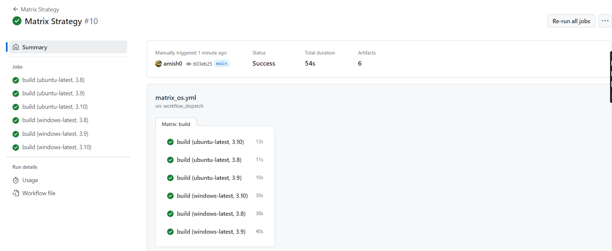
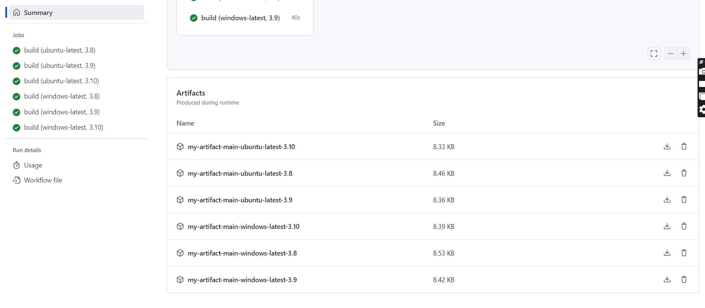
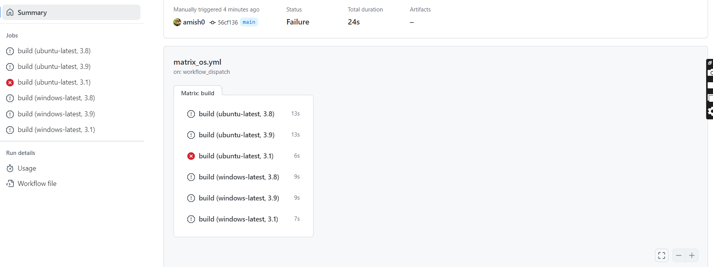
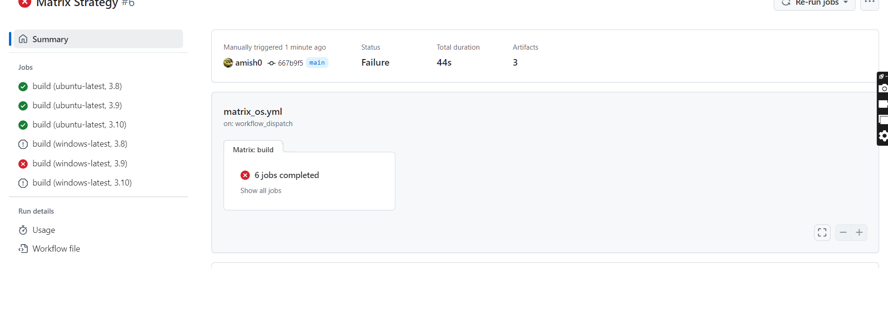

# Github Matrix Stategry & ReUsable Workflow

## Github Matrix Strategy
What is a matrix strategy? A matrix strategy is a way to run a job multiple times with different configurations. This is useful when you want to test your code against multiple versions of a language, multiple operating systems, or multiple dependencies.

### Example
```yaml
jobs:
  build:
    runs-on: ${{ matrix.os}}
    strategy:
      matrix:
        os: [ubuntu-latest, windows-latest]
        python-version: ['3.8', '3.9', '3.10']
    outputs:
      # my-artifact: ${{ steps.upload-artifact.outputs }}
      build_flage: ${{ steps.start_build_id.outputs.name }}
    steps:
      - name: start build
        id: start_build_id
        run: echo "name=staarting build">> $GITHUB_OUTPUT
      - name: get code 
        uses: actions/checkout@v4
      - name: python action setup
        uses: actions/setup-python@v5
        with:
          python-version: ${{ matrix.python-version }}
      - name: installing dependency
        run: pip install -r requirements.txt
```
This workflow will run the `build` job 8 times, once for each combination of `os` and `python_version`. The `os` and `python_version` values are defined in the `matrix` section of the `strategy` key.


 

"matrix" is a list of key-value pairs. Each key is a variable name, and each value is a list of values for that variable. The workflow will run once for each combination of values in the matrix."


If any error occurs in any of the matrix, the workflow will stop  for all jobs and the error will be shown in the logs.


if you want to run the workflow even if one of the matrix fails, you can use the `fail-fast` key in the `strategy` section. 
```yaml
jobs:
  build:
    runs-on: ${{ matrix.os}}
    strategy:
      matrix:
        os: [ubuntu-latest, windows-latest]
        python-version: ['3.8', '3.9', '3.10']
      fail-fast: false
    outputs:
      # my-artifact: ${{ steps.upload-artifact.outputs }}
      build_flage: ${{ steps.start_build_id.outputs.name }}
    steps:
      - name: start build
        id: start_build_id
        run: echo "name=staarting build">> $GITHUB_OUTPUT
      - name: get code 
        uses: actions/checkout@v4
      - name: python action setup
        uses: actions/setup-python@v5
        with:
          python-version: ${{ matrix.python-version }}
      - name: installing dependency
        run: pip install -r requirements.txt
```
 

## ReUsable Workflow 